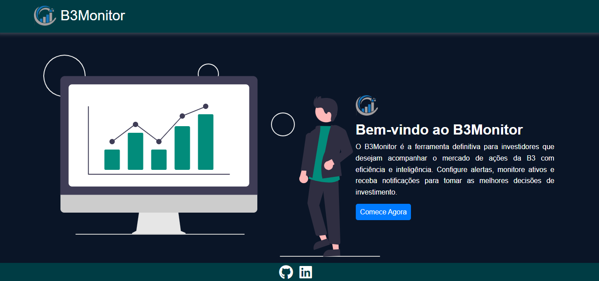
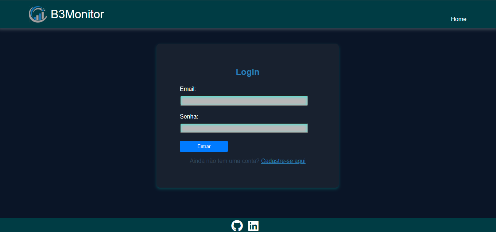
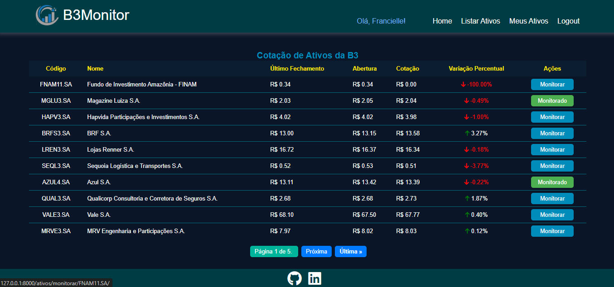
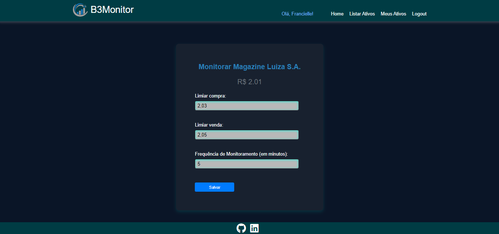
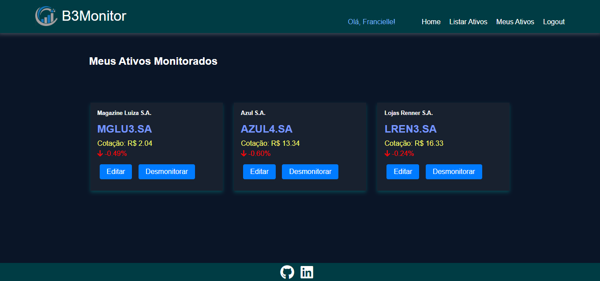

# B3 Monitor

O B3Monitor é uma aplicação web desenvolvida para facilitar o monitoramento de ativos financeiros negociados na B3 (Bolsa de Valores do Brasil). Com uma interface amigável, o sistema permite que os usuários acompanhem cotações, configurem alertas de preço e gerenciem seus ativos preferidos.

>## Layout

>## Funcionalidades do projeto

- [x] Monitoramento de Ativos: Acompanhe em tempo real as cotações dos ativos da B3.
- [x] Configuração de Alertas: Receba notificações baseadas em critérios de preço definidos por você.
- [x] Gerenciamento de Portfólio: Mantenha uma lista de seus ativos preferidos e monitore-os de forma eficiente.
- [x] Integração com APIs Externas: Dados de cotação obtidos diretamente de fontes confiáveis através de integrações com APIs como Yahoo Finance e B3 API.
- [x] Paginação e Busca de Ativos: Navegue facilmente através da lista de ativos e encontre rapidamente o que está procurando.

>## Tecnologias Utilizadas

- Backend: Python (Django)
- Frontend: HTML, CSS (Bootstrap), JavaScript
- Database: SQLite (padrão do Django para desenvolvimento)
- Schedule - Agendador em processo para tarefas periódicas
- Bibliotecas e APIs: yfinance, requests, APIs de cotação financeira

>## Configuração do Ambiente de Desenvolvimento

- Python 3.8+
- pip (gerenciador de pacotes do Python)

>## Instruções de Instalação

1 - Clone o Repositório
    
    git clone https://github.com/franfernandes/AtivosB3.git

2 - Crie e Ative o Ambiente Virtual 
    
    * No windows
    python -m venv myenv
    myenv\Scripts\activate
    

    * Linux
    python3 -m venv myenv
    source myenv/bin/activate
    

3 - Instale as dependências
    
    pip install -r requirements.txt

4- Execute as Migrações do Django
    
    python manage.py makemigrations
    python manage.py migrate

5- Inicie o Servidor de Desenvolvimento
    
    python manage.py runserver

6- Inicie o Servidor de Desenvolvimento
    
- Abra seu navegador e acesse http://127.0.0.1:8000.

>## Estrutura do Projeto

 - ativos/: Diretório do aplicativo principal que contém lógicas de view, modelos, formulários, etc.
 - investidor/: Diretório do projeto que contém configurações globais.
 - templates/: Diretório que contém os arquivos HTML.
 - static/: Diretório que contém arquivos estáticos como CSS, JS e imagens.
