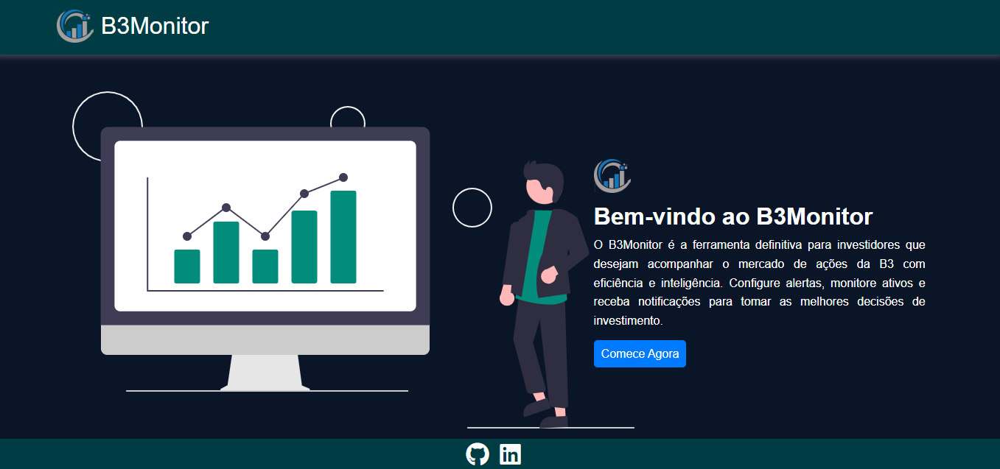
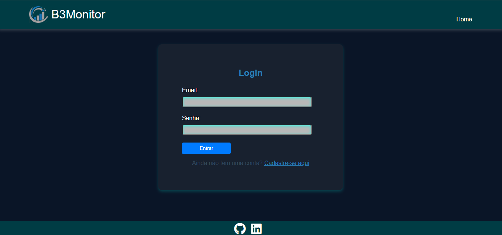
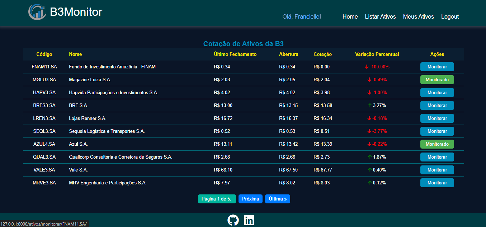
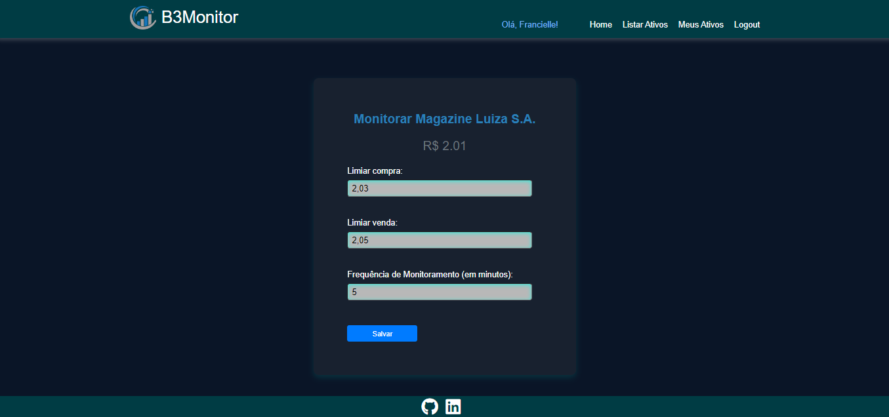
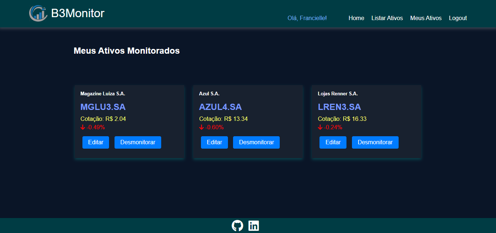

# B3 Monitor

Aplicação web em Django para acompanhar ativos negociados na B3, definir
limites de compra e venda e receber alertas quando uma cotação atingir o valor
configurado.

O projeto foi desenvolvido como uma aplicação full stack renderizada pelo
Django: o backend consulta dados externos, persiste ativos e preferências do
usuário, enquanto templates HTML e CSS entregam a interface web.

## Funcionalidades

- Cadastro e autenticação de usuários.
- Consulta de lista e cotações de ativos pela API brapi.
- Paginação que consulta os detalhes apenas dos ativos exibidos na página.
- Seleção de ativos para monitoramento individual.
- Definição de limiares de compra e venda.
- Atualização periódica da cotação e envio de alertas por e-mail.

## Telas







## Tecnologias

- Python 3.10+ e Django 5.2 LTS.
- SQLite para desenvolvimento local.
- APScheduler para executar monitoramento em ambiente de demonstração.
- `requests` e `truststore` para integração HTTPS segura com a brapi.
- Templates Django, HTML e CSS para o frontend.
- Testes automatizados com `django.test` e mocks para integrações externas.

## Arquitetura

```text
investidor/          configurações, URLs globais e inicialização Django
ativos/
  api.py             clientes das APIs externas
  models.py          usuário customizado e ativos monitorados
  views.py           fluxos web e persistência das cotações
  tasks.py           atualização de preço e alertas
  scheduler.py       agendamento local das tarefas
  tests.py           testes da regra de negócio sem chamadas externas reais
  templates/         interface renderizada no servidor
```

Fluxo principal:

1. O usuário autenticado abre a listagem de ativos.
2. O backend obtém os símbolos e as cotações na API brapi.
3. O usuário define limites de monitoramento para um ativo.
4. Uma tarefa associada ao ativo consulta a cotação atual, salva o novo valor e
   envia um alerta quando algum limite é atingido.

## Executando Localmente

1. Clone o repositório e acesse a pasta:

   ```bash
   git clone https://github.com/franfernandes/AtivosB3.git
   cd AtivosB3
   ```

2. Crie e ative um ambiente virtual:

   ```bash
   python -m venv .venv
   # Windows
   .venv\Scripts\activate
   # Linux/macOS
   source .venv/bin/activate
   ```

3. Instale as dependências:

   ```bash
   pip install -r requirements.txt
   ```

4. Crie seu arquivo local de configuração:

   ```bash
   # Windows PowerShell
   Copy-Item .env.example .env
   # Linux/macOS
   cp .env.example .env
   ```

   Substitua `DJANGO_SECRET_KEY` por uma chave exclusiva. Sem
   `BRAPI_API_KEY`, a aplicação usa os quatro tickers liberados pela brapi para
   demonstração: `PETR4`, `MGLU3`, `VALE3` e `ITUB4`. Configure um token
   somente no arquivo `.env` local para consultar outros ativos.

5. Prepare o banco e suba a aplicação:

   ```bash
   python manage.py migrate
   python manage.py runserver
   ```

6. Acesse `http://127.0.0.1:8000/`.

## Testes

Os testes não dependem de APIs externas ou envio real de e-mail:

```bash
python manage.py test
```

Eles validam a gravação correta do último fechamento, a paginação das consultas,
a proteção da ação de desmonitorar via `POST`, as rotas públicas e a atualização
da cotação antes do envio de alerta.

## Segurança E Decisões Técnicas

- Chaves de API, senha SMTP e `SECRET_KEY` são lidas de variáveis de ambiente.
- `.env`, bancos SQLite, ambientes virtuais e arquivos compilados não devem ser
  versionados.
- O backend de e-mail padrão imprime mensagens no terminal; SMTP real exige
  configuração local explícita.
- A integração externa é isolada em `api.py`, utiliza certificados confiáveis
  do sistema operacional e é mockada nos testes.
- A ação que remove monitoramento utiliza `POST` e proteção CSRF.
- Cada job do agendador recebe o identificador de um ativo, evitando que jobs
  diferentes processem novamente toda a carteira.
- Os limites aceitam apenas valores coerentes: compra menor que venda e
  frequência mínima de um minuto.

Para uma implantação real com múltiplas instâncias, o agendador em processo
deve ser substituído por uma fila de tarefas/worker, como Celery com Redis, para
evitar execução duplicada e permitir escalabilidade.

## Próximos Passos

- Expor endpoints REST com Django REST Framework ou FastAPI.
- Separar frontend em React/Next.js consumindo a API.
- Adicionar PostgreSQL, containerização e pipeline de integração contínua.
- Criar histórico de alertas e evitar alertas repetidos para o mesmo limiar.
- Extrair a entidade `Monitoramento` para permitir limites diferentes por
  usuário no mesmo ativo.
